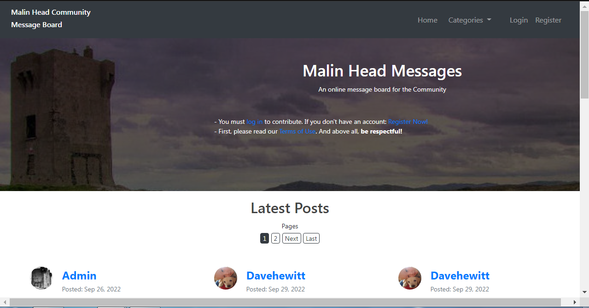
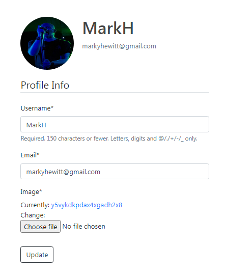
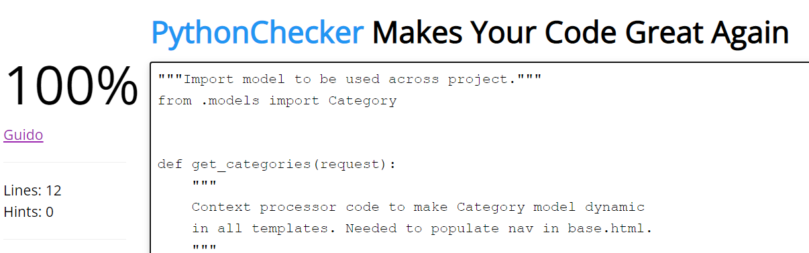
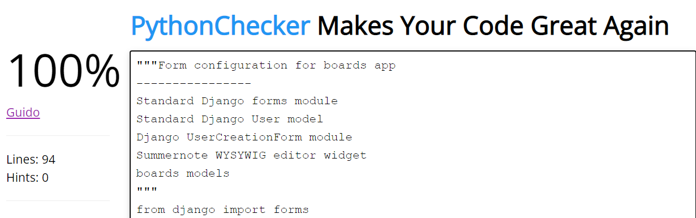
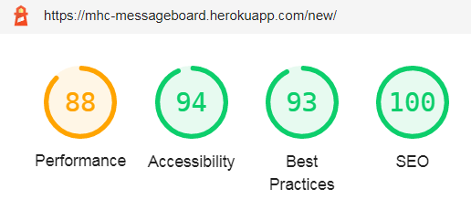

# Malin Head Messages (Malin Head Community Messageboard)

  

[View the Live Website here](https://mhc-messageboard.herokuapp.com/)

[Link to GitHub Repo](https://github.com/MarkHewitt76/mhc-message-board)

***

## About

 

Malin Head Messages is an online messageboard / blog for the community of Malin Head, Co. Donegal; Ireland's most northerly point. The website is built for a small village community, (pop. ~600), as well as ex-pats and visitors, with the intention of providing an online source of information, entertaining debate, opinions and a hub for the exchange of goods and services. The website uses the name and supporting online presence of the [Malin Head Community Association](https://www.malinheadcommunity.ie/), with permission, in the hopes of providing an air of legitimacy and trustworthiness to potential users, as well as forming a loose affiliation in the hopes of future collaboration. 
Through clear and intuitive design, Malin Head Messages' goal is to help all possible users, no matter their age or background, to remain informed on and get involved in their local community.

***
 

## Index - Table of Contents

* [UX - User Experience Research & Design](#user-experience-research-and-design)
    * [Strategy: Agile and User Stories](#Strategy)
    * [Scope: Planned Features](#Scope)
    * [Structure: Design Considerations](#Structure)
    * [Skeleton: Wireframes (Mobile-First Design)](#Skeleton)
    * [Surface: Visual Design (Colours, Fonts, etc.)](#Surface)
* [Data Model](#Data-Model) 
* [Features](#Features)
* [Testing](#Testing)
* [Deployment](#Deployment)
* [Credits](#Credit)

 

***
 

## User Experience Research and Design

 

### Problem Statement

It is rare and difficult to find a website or app where you can share and discuss local news and opinions, or advertise goods and services on a local level.
People may, of course, interact freely through Facebook, twitter and other large social media platforms. But these platforms often swamp the user with advertisements and the companies behind them are increasingly gaining a reputation for untrustworthiness, especially in the areas of privacy and the gathering and sharing of personal information.
These platforms are also so huge in scope that it can be difficult to find the information you're looking for or the people you want to connect with. They have so many features, they can prove daunting to those less comfortable with technology.
There's an opportunity to provide people with a free, uncomplicated communication hub, making it easier for them to stay informed and stay in touch with their local community.

 

### Objective

Develop and deploy a website that promotes the free and simple sharing of information and ideas within a small community, thereby promoting involvement and sociability in an uncomplicated setting. 
All visitors can read messages and view them by category or according by author. Users who create a Malin Head Messages profile will be able to comment on and like messages, as well as posting their own. The site will aim to meet WCAG 2.1 AA standards, and will be thoroughly tested to ensure all user groups can access and enjoy content.

 

### Strategy

For this project, I followed an Agile development process. In the initial design and planning phase, this led to the drafting of User Stories which were tracked through to completion during development using a GitHub Project with linked Issues as the Agile tool. User Stories were defined using GitHub Issues, initially compiled into a Product Backlog, then grouped into timeboxed Iterations of 24 hours each. The Product Backlog and Iterations were grouped using Github Milestones and development of code for each iteration was tracked using a Kanban board. (The notes and descriptions of Acceptance Criteria and tasks for each user story made in the planning phase were lost due to a major hardware failure and the resulting time constraints led to their omission during development. But I hope to be able to recover or recompile them and add them back in at a later date.)

 

#### User Stories

- **US#1**: As a **Site User / Admin** I can **view a list of posts** so that **I can select one to interact with**.

- **US#2**: As a **Site Admin** I can **create, read, update and delete posts (CRUD)** so that **I can manage my contributions to the site**.

- **US#3**: As a Site Admin I can **create draft posts** so that **I can finish writing the content later**.

- **US#4**: As a **Site User** I can **click on a post** so that **I can interact with it**.

- **US#5**: As a **Site User / Admin** I can **view comments on an individual post** so that **I can read the conversation**.

- **US#6**: As a **Site User / Admin** I can **view the number of likes on each post** so that **I can see which is the most popular or viral**.

- **US#7**: As a **Site User** I can **register an account** so that **I can contribute to the site**.

- **US#8**: As a **Site User** I can **Log in and out of my account** so that **I can keep my contributions secure**.

- **US#9**: As a **Site User / Admin** I can **view and edit my profile** so that **I can change my username / email address and upload / change my profile picture**.

- **US#10 - EPIC**: As a **Site User** I can **create, read, update and delete posts (CRUD)** so that **I can manage my contributions to the site**.
    - **US#10a**: As a **Site User** I can **create posts (C rud)** so that **I contribute to the site**.
    - **US#10b**: As a **Site User** I can **read posts (c R ud)** so that **I can see my own and others' contributions to the site**, (see US#4). 
    - **US#10c**: As a **Site User** I can **update my posts (cr U d)** so that **I can control the content of my contributions to the site**. 
    - **US#10d**: As a **Site User** I can **delete my posts (cru D)** so that **I can control the visibilty and longevity of my contributions to the site**. 

- **US#11**: As a **Site User / Admin** I can **view posts by category** so that **I can find posts more easily**.

- **US#12**: As a **Site User / Admin** I can **view a list of posts by a specific user** so that **I can find an individual's post more easily**.

- **US#13**: As a **Site User / Admin** I can **view paginated lists of posts** so that **I can navigate the site more easily**.

- **US#14**: As a **Site User / Admin** I can **leave comments on a post** so that **I can be involved in the conversation**.

- **US#15**: As a **Site User / Admin** I can **like or unlike a post** so that **I can interact with the content**.

- **US#16**: As a **Site User / Admin** I can **reset my account password if I've lost or forgotten it** so that **I can continue to use my account**.

- **US#17**: As a **Site User** I can **email the Site Admin directly from the site** so that **I can address any problems, questions or issues that may arise with my use of the site**.

- **US#18**: As a **Site User** I can **receive live feedback on my contributions to the site** so that **I can tell immediately if my actions were successful**.

- **US#19**: As a **Site User** I can **edit and/or delete my comments without involving the Site Admin** so that **I have more control of how I am percieved on the site**.

- **US#20**: As a **Site User** I can **see when a post or comment was last updated or edited** so that **I can keep track of any new information pertaining to a topic**.

- **US#21**: As a **Site User / Site Admin** I can **use a WYSIWYG or rich-text editor when creating or updating posts** so that **my posts appear are more attractive and appealing that simple plain text**.

- **US#22**: As a **Site Admin** I can **get an email notification of new posts and/or comments** so that **I can filter out objectionable content**. (Archived to product backlog for future implementation).

 

Each Iteration and its associated Kanban board can be viewed at the following links:

- [Iteration 1](https://github.com/MarkHewitt76/mhc-message-board/milestone/2?closed=1) / [Iteration 1 board](https://github.com/users/MarkHewitt76/projects/1)

- [Iteration 2](https://github.com/MarkHewitt76/mhc-message-board/milestone/3?closed=1) / [Iteration 2 board](https://github.com/users/MarkHewitt76/projects/2)

- [Iteration 3](https://github.com/MarkHewitt76/mhc-message-board/milestone/4?closed=1) / [Iteration 3 board](https://github.com/users/MarkHewitt76/projects/3)

- [Iteration 4](https://github.com/MarkHewitt76/mhc-message-board/milestone/5?closed=1) / [Iteration 4 board](https://github.com/users/MarkHewitt76/projects/4)

- [Iteration 5](https://github.com/MarkHewitt76/mhc-message-board/milestone/6?closed=1) / [Iteration 5 board](https://github.com/users/MarkHewitt76/projects/5)

- [Iteration 6](https://github.com/MarkHewitt76/mhc-message-board/milestone/7?closed=1) / [Iteration 6 board](https://github.com/users/MarkHewitt76/projects/6)

- [Iteration 7](https://github.com/MarkHewitt76/mhc-message-board/milestone/8?closed=1) / [Iteration 7 board](https://github.com/users/MarkHewitt76/projects/7)

 

### Scope

An agile approach of keeping the in scope features simple and aligned to the strategy for the Minimum Viable Product (MVP) will be adopted. Below is a list of the leading features for the Malin Head Messages MVP.

#### In Scope Features
* Create an accessible website that appears conventional for sites built to inform.
* As per convention, the site will have a sticky navbar and a footer at the end of every page.
* The Main Menu will be accessible via a hamburger icon on smaller screens, appearing as an inline list on medium and larger screens.
* By default, the homepage will show the latest message posts in descending order.
* A clickable post preview will enable users to read and interact with the full post.
* A user account will provide the ability to Post a Message, Comment on a Message and Like/Unlike a Message.
* Users will be able to edit and/or delete their own posts and comments.
* A 'Contact Admin' link will enable users to get in touch with the Site Admin.
* A standard Terms and Conditions statement will inform the user of Malin Head Messages' and Malin Head Community Association's terms of use for the site, their limited liabilty, etc. It will be stated that use of the site implies acceptance of the aforementioned terms.
* The site will be responsive across differing devices with mobile first design. Small screens beginning at min. 320px wide through to large max. 2300px wide screens will be supported.

#### Out of Scope Features - for future release
* Search: Using keywords, users will be able to search for messages, content or other users.
* Email verification on signup: Users will have to verify their email address before a profile is created for them
* Enhanced profile: Recent activity compiled from users' activity data; user bios; etc. To be added into the profile page with, additionality, the ability to view other users' basic profile info.
* Single Sign On (SSO): The use of social media apps such as Google, Facebook and Twitter to sign-in.
* Connecting the Community: Provide a chat service to allow the community to interact on a one-to-one basis.
* Email notification of activity: The Site Admin to be alerted via email when a new post, image or comment is added so that it can be reviewed according to the Terms of Use.
* Dynamic interaction: The ability to post comments and likes without the page reloading.

 

### Structure

This website will be structured with the following design considerations.

* A 'Hub and Spoke' structure, where the main content will be the homepage Hub and navbar. Spokes are the pages on which to view and interact with a message post. The spokes will also house useful pages such as Sign-up and Contact forms, Edit Profile, view by category or author, etc.
* Each post will be displayed as a smaller preview in a table-like list on the homepage and filtered list pages, with just enough information to entice the user to view the entire message. The posted message's image, title and preview text will be clickable and will open a new page with the full message, comments, comment form, etc.
* Users wishing to add a message, comment or like will be asked to first create a user account. Once a brief form has been completed and submitted, users will have immediate access to all features. 
* Having a user account will allow users to interact with the site; add comments, likes and post their own content.
* All site visitors will be able to contact the Site Admin through a contact form available via links in the (Homepage hero banner?) Terms of Use, Footer or on various forms. 
* All main pages will be available to users constantly from the Main Menu. This should ensure users are never more than two clicks away from where they would like to be.

 

### Skeleton

Key to the UX design of the site is the speedy and simple access to messages and/or categories. 

The 'Hub and Spoke' structure should provide users with content from their initial landing, and pique their interest enough to click on a message post and read more, or refine the content by choosing one of five categories, located conveniently in the NavBar Menu, or by clicking the category name that is displayed on every message, whether listed on the homepage, filtered lists or the full message view. The user should also be able to click on the post author's username to see a list of messages left by that person. 

Aesthetically, pages will be clean and uncluttered and lists will be paginated. This will give prominence to the messages themselves and allow users to move easily between different category lists, user posts lists and full messages, so as to learn more and add contributions. Conventional styles and layouts from popular blog and information-based sites will be adopted so users feel at home, therefore ensuring their engagement within the first few seconds.

#### Wireframes

The wireframes for this project were sketched out manually using [Corel Paint Shop Pro Photo XI](http://www.corel.com/akdlm/6763/downloads/Documentation/UserGuides/EN/CorelPaintShopProPhoto.pdf). Unfortunately however, they were lost as a result of a catastrophic hardware failure and therefore are not included here due to the resulting time constraints. I hope to be able to recover or reconstruct them for inclusion at a later date. 

Much care has been taken to ensure that the website is responsive through differing screen widths and designed for mobile first, from a min-width of 320px to a max-width of 767px. Tablets are responsive from 768px through to 1023px, laptops from 1023-1440px, and desktops from 1440px upward. The [Bootstrap 4.6](https://getbootstrap.com/docs/4.6/getting-started/introduction/) grid system with its associated breakpoints was utilised as starting point in order to ensure this.

 

### Surface 

with the consideration in mind that accessibility is a key design criteria, the visual language offers contrast using a simple colour palette, readable font and clear layout. Throughout the website this language has been applied consistently to promote intuitive use of the website, with the most important links and information easily recognised.

#### Colour

The palette is based around Bootstrap's navbar-dark colour scheme, as that was my starting point for the overall design of this project. The reamining colours have been carefully selected for contrast in order to improve accessibility to visually impaired users. As the primary aim of the site is to inform, dark text on a white background is adopted throughout. The navbar and footer colours are reversed, while traditional light blue and red accents, as well as hover and active effects, will be used to highlight link text, buttons, points of reference or navigation and other key pieces of user information. Feedback for virtually every user action will be instantaneous via the use of alert messages, with the standard 'success' and 'warning' colours, appearing immediately beneath the navbar and fading after a few seconds.

#### Logo

The words 'Malin Head Community Message Board' function as a logo on the left side of the navbar in strong, white text against the dark grey background.

    

 

#### Font

**Helvetica Neue**

The default Bootstrap 4 font family of '"Helvetica Neue", Helvetica, Arial, sans-serif' has been used throughout the site for convenience and for its clean lines and legibility. Widely used across the web, it also lends itself well to use in larger text headers, offering a nice contrast to body text.

 

***

 

## Data Model

The initial handwritten draft of the data models has been mapped into a data schema and the Entity Relationship Diagram (ERD) below using [draw.io](https://www.draw.io/index.html) to help understand how the entities and data will relate across the site.

With consideration given to the requirement for the data to be searchable, (and possibly map patterns and trends in user behaviour in the future), an Object-Relational Database using MVT (Model, View, Template) architecture has been selected. I've opted for a PostgreSQL DBMS (Database Management System) as it can support the aforementioned requirements. PostgreSQL can also support the multiple programming languages and libraries that will be used to build the Malin Head Messages application.

The diagram below shows the entity relationships between a message post and its comments. The Post model is used by the Comment model to ensure the right message post is being commented on. The diagram also highlights that one message post can have many comments. 

The key component in this relationship is the user. I have used the default Django User model for convenience, and whilst this is not declared in the models.py file, I have included within the diagram for clarity. The default User model has also been extended to a UserProfile model with a one-to-one relationship, to allow for the uploading of profile images. 

Also, while many users can 'like' many posts, one user can only have one like per post. This functionality is built into the code related to the Post model itself and so has not been explicitly referenced in this diagram. 

The Category model has a foreign key (one-to-many) relationship with the Post model. Category instances are created within the Django Admin panel. These are displayed to the user as a dropdown field choice when adding a blog post and are also added dynamically to the dropdown list in the navbar as they are created.

The diagram highlights the following relationships:
* One Post can have one author (User)
* One Post can have one Category
* One Post can have many Comments
* One Post can have many likes
* One Category can have many Posts
* One User can have many Posts
* One User can have many Comments
* Many Users can like many Posts
* One User can have one UserProfile

 

    

 

### Data Security

Specific steps have been taken to ensure the security of users' data and the website's integrity. These are as follows:
* The use of an env.py file to store key variables for accessing secure environments: Postgres database; remote media and static file storage; email SMTP server.
* A gitignore file has been incorporated to ensure the env.py file is never committed to the Github repository in which this projects files are stored, therefore maintaining the security of these key variables.
* Additionally, these variables are stored as Config Variables in the application's settings on Heroku, the application's host site, in order to ensure that Github and Heroku can synchronise securely.
* Cross Site Request Forgery (CSRF) tokens have been applied to all HTML Forms. Their application provides protection from malicious attacks when users may be performing certain actions or sending data when logged in.
* Django's inbuilt user authentication has been applied to several key areas to ensure only approved users can add, comment on or like message posts. A further layer of security has been applied to ensure that the ability to edit or delete a blog post can only be accessed by the user that has authored the post.

### Meta data

Meta data is included within the HTML head element to increase the traffic to the website. Additionally, site pages are titled appropriately in order to ensure that users are constantly aware of their location. Favicons are used in the browser tab and as desktop thumbnails across all platforms to add to site recognition.

***

 

## Technologies

### Languages

* HTML5
* CSS3
* Python
* JavaScript/Jquery

### Frameworks & Libraries

* [Django 3.2](https://docs.djangoproject.com/en/4.0/releases/3.2/) has been adopted preferentially to the newest Django 4 beta release as, at the time of development, it is more fully supported. This is in order to ensure more rapid and secure development of this application.
* [dj_database_url](https://pypi.org/project/dj-database-url/). This library has been used to allow database urls to connect to the Postgres database.
* [Psycopg2](https://pypi.org/project/psycopg2/) supports the connection to the Postgres database.
* [Gunicorn](https://gunicorn.org/) has been used as the Web Server to run Django on Heroku, the host service for this application.
* [Django.contrib.auth](https://docs.djangoproject.com/en/4.1/topics/auth/) has been used for addressing user authentication, registration and account management.
* [Bootstrap 4.6](https://getbootstrap.com/docs/4.6/getting-started/introduction/) has been used to help in the building of responsive web pages and to make [JavaScript](https://developer.mozilla.org/en-US/docs/Web/JavaScript) and [JQuery](https://developer.mozilla.org/en-US/docs/Web/JavaScript) accesssible, though they are sparsely used. Bootstrap 4.6 has been used over the latest Bootstrap 5 version for convenience, due to this developer's greater experience with the earlier version.
* [Summernote](https://summernote.org/) has been used to provide WYSIWYG editing of message post content on the admin side. It was also included, experimentally, in the front-end message creation and update forms via an iframe widget with the settings and toolbar customised. This allows users to avail of more style options when creating and editing a message, as well as the ability to include pictures and links in the body of their messages. The extent of users' adoption of this functionality will determine the feasibility of Summernote's ongoing front-end inclusion, vis-a-vis its impact on the site's accessibility. 
* [Crispy Forms](https://django-crispy-forms.readthedocs.io/en/latest/) has been used for its convenient simplification of the rendering of forms.
* [Cloudinary](https://cloudinary.com/products/programmable_media) has been used for remote storage of both the website's main imagery and images uploaded by users, as well as for the website's static/css files.

### Software & Web Applications

* [Font Awesome](https://fontawesome.com/) has been used to add icons for aesthetic and UX purposes.
* [Real Favicon Generator](https://realfavicongenerator.net/) has been used to generate the favicons from an uploaded image.
* [Corel Paint Shop Pro Photo XI](http://www.corel.com/akdlm/6763/downloads/Documentation/UserGuides/EN/CorelPaintShopProPhoto.pdf) has been used to draw wireframes and to edit default images used on the website.
* [draw.io](https://www.draw.io/index.html) has been used to draw the ERD for the data model.
* [GitPod](https://gitpod.io/) has been used used for the IDE and [GitHub](https://github.com/) as a hosting repository. In addition, GitHub was used for the agile development aspect of this project, through the use of User Stories (GitHub Issues), Iterations and Product Backlog (Github Milestones), as well as tracking User Stories during development on a Kanban board (Github Projects).
* [Heroku](https://dashboard.heroku.com/) has been used to host the Malin Head Messages website, including the database.
* [HTML Validator](https://validator.w3.org/) has been used to validate the HMTL code.
* [W3 CSS Validator](https://jigsaw.w3.org/css-validator/validator) has been used to validate the CSS code.
* [PyhtonChecker](https://www.pythonchecker.com/) has been used to validate the Python / Django code.

***

 

## Features

### Current Features

- __Homepage__
    
    All site visitors land on an informative hero banner with an attractive background image of Malin Head's famous WWII signal tower, with content visible beneath. Within the banner are the main heading and subheading, which are followed by information for the user on the requirements for use of the site. This information changes slightly depending on whether or not the user is logged in and includes call to action links such as: 'Post a Message' if logged in; 'Log In' and 'Register Now' if not logged in; and a collapsible dropdown link which displays the site's Terms of Use.   
    Message posts are listed in descending order by date updated, so as to ensure that the latest activity is seen first. Each listed post displays: the author's username (clickable) and profile picture; the post's 'Created' on and 'Updated' on information; the category name (clickable) assigned to the post by the author; the post's featured image, title and a preview of its content (all clickable); and a counter showing the number of likes a post has, with a 'thumbs-up' icon.
    The list is paginated with six message posts per page and a maximum of three posts per row on larger screens. If the list exceeds 6 posts, pagination buttons appear at both the top and bottom of the page. Displayed inline and sized to fit all screen widths yet remain readable, they consist of 'First' and 'Prev' buttons which load the first and previous pages of the list, 'Next' and 'Last' buttons for the next page and final page, with up to five numbered page buttons in between.
    'First' and 'Next' will not appear on the first page of the list. 'Next' and 'Last' will not appear on the final page. The page number buttons all link to the corresponding page number of the list and the current page's number is highlighted, with up to two preceding and two following page numbers on either side.  

    

 

- __NavBar__

    With the utilisiation of Bootstrap's collapsible NavBar, users are given a clear and simple method of accessing the site's main features.
    The main menu is on the right hand side, appearing as a conventional hamburger menu icon on smaller screens that, when clicked, reveals a collapsible menu offering a link back to the homepage, a dropdown list of message post categories and user features. The user features differ depending on whether or not a user is logged in. On medium and larger screens, the navbar diplays an inline list of menu items. 
    The Malin Head Community Message Board name/logo is on the left and acts as a link back to the homepage.
    The hamburger menu and 'Categories' dropdown list both collapse either when the icon/dropdown link is clicked or when the user chooses a menu item.
    Features available to users within the menus depend on their login status. If a user is logged in they will see options to create a New Message, Edit Profile or Logout. If they are not logged in, they will see options to Login or Register.

    

 

    

 

- __Footer__

    The Footer consists of a copyright statement, with JavaScript used to automatically keep the year up to date. It also contains links to the Malin Head Community Association website and social media pages, as well as a Contact Admin link.

    

 

- __Create a Message__

    Registered users have the ability to add content by creating a message post. A simple form asks for details to be entered into the following fields:
    * Title (required);
    * Category (required) - a dropdown list of preset categories;
    * Content (required) - incorporates a WYSIWYG rich-text editor with a toolbar of options including buttons for font style, type, size and colour, lists, paragraph alignment, line height, insert link and insert image;
    * Image (optional) - a 'Choose file' button calls up the browser's file mananger and the selected image's filename is displayed, if any.
    
    If no image is uploaded, each category has its own default image which will be displayed instead. Uploading a featured image currently works best on desktop applications due to the more convenient file management systems thereon, but has been tested and works well on tablet and mobile also.
    On clicking the form's 'Post' button, users are either asked to fill in any required fields they may have missed, or redirected to the newly created message's detail page. A success alert message then appears below the navbar, fading away after a few seconds. There is also a cancel button that will return the user to whatever page they were previously on should they change their mind or have navigated there by mistake.
    Users can update their posts, including uploading an image at any time (see below).

    

 

- __Read a Message__

    When a user clicks on the featured image, title or preview text of a message post, whether from the main homepage list view, category page or posts by 'user' page, they are taken to a single page that displays the full message plus additional features.
    All site visitors will be able to read the message and any comments. The message displays: the author's username (clickable) and profile picture; the message's 'Created' on and 'Updated' on information; the category name (clickable) assigned by the author; and the message's featured image, title and full content. Counters display the number of likes and comments the message has beside 'thumbs-up' and 'speech bubble' icons respectively.
    Comments are listed in descending order by date created beneath the message, so as to better represent a conversation. (A 'Comments:' heading with a counter showing the number of comments appears above them.) Each comment displays its author's username and profile picture, as well as its 'Posted' on and 'Edited' on information above the comment's body text. 
    If users are registered and logged in they will be able to like or unlike a post in the conventional manner by clicking the 'thumbs-up' icon. A comment form also appears between the 'likes' and 'comments' icons and the list of comments with the heading 'Add a comment', so that logged in users can leave a comment. The current user's username and profile picture appears above the comment form with the prefix 'As:'. If the current user is the author of a message post or comment, Update/Edit and Delete buttons will appear underneath the relevant item.

    

 

    

 

- __Update a Message__

    Users that have contributed by creating a message post will have control over the content should they wish to make changes. This feature will be visible **only** to them on the full message detail page as an Edit button. This will direct the user to the same form that they used when creating the message, (see above), but prepopulated with the current content of the message to be updated.

    

 

- __Delete a Message__

    Users that have contributed by creating a blog post will have the ability to delete that post if they wish. This feature will be visible **only** to them on the full message detail page as a Delete button. The user will be redirected to a confirm deletion page and asked if they are sure that they wish to delete the post. There is a Cancel button that will return them to the message's detail page should they change their mind or have navigated there by mistake.

    

 

- __View Messages by Category__

By selecting a category from the collapsible 'Categories' list in the navbar, or by clicking on the category name in any list of message posts or full message detail page, the user will be taken to a page listing only the message posts in the selected category. The page's heading consists of the category name and a counter showing the total number of posts in that category. The format of this list is identical to the list of posts found on the homepage, including pagination, with pagination buttons as required.

    

 

- __View Messages by User__

By clicking on a username in any list of message posts or full message detail page, the user will be taken to a page listing only the message posts by the selected user. The page's heading consists of the selected username name and a counter showing the total number of posts in by that user. The format of this list is identical to the list of posts found on the homepage and in the lists of category posts, including pagination, with pagination buttons as required.

    

 

- __User Authentication__

The application provides the following user authentication functions:

- **Register**
    - A user needs to be registered before they can log in. The option to Register appears on the navigation bar when no user is currently signed in. To Register, the user needs to provide: a username which has not already been registered; a valid email address; and a password which they must enter twice. Once registered a user can log in.     

    

    
    

     

- **Login**
    - Once registered a user can log in and will have access to extra functionality. Namely:
        - The ability to create, update and delete a message
        - The ability to comment on a message
        - The ability to edit and delete their comments
        - The ability to upload a profile image

    - To log in the user must provide a registered username and the password for that username

    

    
    

     

- **Logout**
    - A logged in user can log out by clicking on the Logout link in the navigation bar. The user will then be taken to a page confirming that they have successfully logged out, with a link inviting them to log in again.

    

    
    

     
    

- __Edit Profile__

    In addition to being able to update content they have posted, registered users will be able to update their account details; i.e. Username, Email Address or optional profile image. This option will only be visible in the navbar when a user is logged in. A user profile is created automatically for each newly registered user and initially assigned the default profile image. If a user wishes to upload their own profile image, they must use this feature. At the time of release, there is no option to delete a user profile and the site Admin must be contacted in order to do so. This will be changed in a future release.
    Passwords can also be updated via a Reset Password link on the login screen. If a user selects this link, they are directed to a form that asks for the email address they used to sign up with. Upon form submission, the built-in Django authorisation library's password reset views will send an automatic email with a link back to a secure, unique url on the site, generated from a base 64 key and an identifier token, where the user can reset their password. 

    

 

    

 

- __Contact Admin__

    An essential feature is a method for users to contact the site Admin. This can be done via a direct email, sent by submitting a short form accessible by various links throughout the site. The form requests some basic information and allows users to describe the reason for contact.

    

 

### Future Features

Features that will be added to the backlog for future releases are as follows:

* Search - The ability to search for message posts, message content or other users through a search bar located in the navbar. 
* Like comments - Allow registered users to like other users' comments.
* Share - Provide options for users to share message posts on their socials, via messaging apps, etc.
* Expanded user profile - Build a user profile page that shows recent activity, posts viewed, likes, comments and adds a user biography.
* View profiles - The ability to view other users' profile pages.
* Email verification on signup - Users will have to verify their email address before a profile is created for them.
* Single Sign On (SSO) - Use social apps such as Google, Facebook and Twitter to sign-in.
* Connecting via chat - Provide chat service to allow the community to interact directly.
* Email notification of activity - Admin alerted via email when a new post, image or comment is added so that it can be reviewed according to the Terms of Use.
* Dynamic interaction - Ability to post comments and likes without page reload.

***

 

## Testing 

 

### Manual Testing 

 

#### **Validator testing**

The code on each file has been tested using the appropriate validation service; W3C Markup for HTML, W3C Jigsaw for CSS and PythonChecker for Python (as Pep8 Online's domain had expired at time of testing).

As this project uses Django templates the html has been validated by manually clicking through the application pages, copying the generated HTML source and pasting it into the W3C Validator. HTML for the Django admin site pages was not edited so has not been validated here. The Register, Password Reset, Login and Logout pages from Django auth were customised and so have been validated. The same copy and paste process was undertaken to test the Python files with Pep8 Online and CSS with W3C Jigsaw.

[HTML Validator](https://validator.w3.org/)

Due to the nature of extending the base.html template the W3C Validator consistently found the following warnings or errors:
- Error: Element div not allowed as child of element ul in this context. (Suppressing further errors from this subtree.) - From Bootstrap 4's collabsible navbar code
- Error: An img element must have an alt attribute, except under certain conditions. For details, consult guidance on providing text alternatives for images. - From generated urls for images uploaded to Cloudinary
- Various warnings from Message post content marked up by the Summernote editor

Other than these there were no warnings or errors to show in the written code

[CSS Validator](https://jigsaw.w3.org/css-validator/)

    
style.css validation results

    

    
    

 

[Python Validator](https://www.pythonchecker.com/)

    
admin.py validation results

    

    
    

 

    
context_processors.py validation results

    

    
    

 

    
forms.py validation results

    

    
    

 

    
models.py validation results

    

    
    

 

    
signals.py validation results

    

    
    

 

    
views.py validation results

    

    
    

 

    
settings.py validation results

    

    
    

 

#### **Lighthouse** 

Using Lighthouse testing within Chrome Developer Tools, the website has been tested for use on Desktop and Mobile devices. 
The website scored well across all criteria, however a storm caused the performance scores to fluctuate somewhat, and it is apparent that a little work still needs to be done to improve accessibility scores.
																	
The following results were achieved:

    
Lighthouse results - Homepage

    

    
    

    
Lighthouse results - Category lists

    

    
    

    
Lighthouse results - Create Message

    

    
    

    
Lighthouse results - Full Message

    

    
    

    
Lighthouse results - User Lists

    

    
    

    
Lighthouse results - Edit Profile

    

    
    

    
Lighthouse results - Login

    

    
    

    
Lighthouse results - Register

    

    
    

    
Lighthouse results - Logout

    

    
    

    
Lighthouse results - Contact Admin

    

    
    

#### **Browser Compatability**

To ensure site visitors can view and use Malin Head Messages features in different browsers, testing was performed on the test scenarios listed below.

To achieve a 'Pass' the following criteria had to be met across all website pages;
1. All buttons provide user feedback on hover and execute correctly when clicked
2. All colours load and displayed correctly
3. All elements retain integrity
4. Fonts and images load
5. Navigation is not impacted and nav-menu collapses as intended

* Chrome DevTools was used to test the responsiveness of the website on different screen sizes. In addition, testing has been carried out on the following browsers:
    * Google Chrome version 9.0.4606.81 (64-bit)
    * Firefox version 93.0 (64-bit)
    * Microsoft Edge 94.0.992.38 (64-bit)

 

#### **Device Testing**

To ensure site visitors can view and use Malin Head Messages on differing devices, testing was performed on the test scenarios listed below.
This physical testing is in addition to the continual device testing as part of UX development using Chrome Developer tools.
				
To achieve a 'Pass' the following criteria had to be met across all website pages;				
1. All buttons provide user feedback on hover and execute correctly when clicked				
2. All colours load and displayed correctly				
3. All elements retain integrity				
4. Fonts and images load				
5. Navigation is not impacted and nav-menu collapses as intended

* The website was tested on various physical devices such as:
    * low and high resolution desktop and laptop displays
    * Various Android tablets and iPads
    * Samsung Galaxy S6, S8, S9 and A52 5G
    * iPhone 8, 11 and 12 Mini.

#### **Manual Testing Test Cases and Results**

Testing in Development and Production has been performed to ensure all the committed features for the MVP are working as designed. 
A large amount of testing was done to ensure that all pages were linking correctly and that no external links were broken.
Friends and family members were asked to review the site and documentation to point out any bugs and/or user experience issues. One family member with impaired vision was asked to confirm that the header, navigation links and content were readable and understandable.

A table of results is available below.

    

    

     
     
     
     
     
     
     
     
    
    

### Automatic Testing

Django testing tools was intended to have been used to perform basic automated testing on Malin Head Messages Python code, primarily for template rendering and some user functionality.

Unfortunately however, time constraints incurred by catastrophic hardware failure meant that this step will have to be postponed until the next release.

 

### Bugs

At the time of writing, all known bugs from the first release have been resolved aside from an intermittent issue with uploading images from iOS mobile devices. The cause of the issue has still not been fully determined and further investigation is required.

 

***

 

## Deployment

This project was deployed using the steps below with version releasing active. Please do not make any changes to files within this repository as any changes pushed to the main branch will be automatically reflected on the live website. Instead, please follow the steps below which guide you to forking the website where changes can be made without impact to the live website. Thanks!

### Fork and Deploy Locally with GitHub

    

To fork this website to either propose changes or to use as an idea for another website, follow these steps:
1. If you haven't yet, you should first set up Git. Don't forget to set up authentication to GitHub.com from Git as well.
1. Navigate to the [Malin Head Messages](https://github.com/MarkHewitt76/mhc-message-board) GitHub repository.
1. Click the 'Fork' button on the upper right part of the page. It's in between 'Watch' and 'Star'.
1. You will now have a fork of the Malin Head Messages repository added to your GitHub profile. Navigate to your own profile and find the forked repository to add the required files.
1. Above the list of forked files click the 'Code' button.
1. A drop-down menu will appear providing a choice of cloning options. Select the one which is applicable to your setup.
 
Further details on completing the last step can be found on GitHub's [Fork a Repo](https://docs.github.com/en/get-started/quickstart/fork-a-repo) page

To deploy locally with GitHub, follow these steps:
1. Log into your GitHub repository, create a GitHub account if necessary
1. Click 'Settings' in the main Repository menu
1. Click 'Pages' from the left-hand side navigation menu
1. Within the Source section, click the "Branch" button and change from 'None' to 'Main'
1. The page should automatically refresh with a url displayed
1. Test the link by clicking on the url
1. From this point you can push code to this page using the following steps from with GitPod;
    1. With the application open, open the command line terminal (CLI)
    1. Stage any changes using the command 'git add .' or by specifying the file with changes i.e 'git add settings.py'
    1. Commit the changes to GitHub by adding a commit message describing the changes i.e. 'git commit -m "Update docbook dependency and generate epub"
    1. Finally add the command 'git push' which will push all the code to GitHub. You can view the deployed code using the url generated within the steps above.
    1. Additionally if you would like to run the application locally pre/post any changes, from the terminal type 'python3 manage.py runserver'.
    1. A dialog box should open asking you to open port 8000, click 'Open' and navigate to the opened tab/window which should allow you to view the running application.
    1. If the dialog box does not automatically appear, find the 'Remote Explorer' section of the left hand navbar within GitPod and click on the port '8000' and the internet/globe icon to the right which should open the running application.

### Deploy with Heroku

    

1. Log in to Heroku at https://heroku.com - create an account if needed.
1. From the Heroku dashboard, click the Create new app button. For a new account an icon will be visible on screen to allow you to Create an app, otherwise a link to this function is located under the New dropdown menu at the top right of the screen.
1. On the Create New App page, enter a unique name for the application and select region. Then click Create app.
1. On the Application Configuration page for the new app, click on the Resources tab.
1. In the Add-ons search bar enter "Postgres" and select "Heroku Postgres" from the list - click the "Submit Order Form" button on the pop-up dialog.
1. Next, click on Settings on the Application Configuration page and click on the "Reveal Config Vars" button - check the DATABASE_URL has been automatically set up.
1. Add a new Config Var called DISABLE_COLLECTSTATIC and assign it a value of 1 - Remove this when releasing for Production.
1. Add a new Config Var called SECRET_KEY and assign it a value - any random string of letters, digits and symbols.
1. The settings.py file should be updated to use the DATABASE_URL and SECRET_KEY environment variable values as follows :

        DATABASES = {'default': dj_database_url.parse(os.environ.get('DATABASE_URL'))}

        SECRET_KEY = os.environ.get('SECRET_KEY')

1. In Gitpod, in the project terminal window, to initialize the data model in the postgres database, run the command : python3 manage.py migrate
1. Update the requirements.txt file with all necessary supporting files by entering the command : pip freeze > requirements.txt
1. Commit and push any local changes to GitHub.
1. In order to be able to run the application on localhost, add SECRET_KEY and DATABASE_URL and their values to env.py

Connect GitHub Repo to Heroku App

1. Navigate to Application Configuration page for the application on Heroku and click on the Deploy tab.
1. Select GitHub as the Deployment Method and if prompted, confirm that you want to connect to GitHub. Enter and search for the required repository, then click on Connect to link them up..
1. Scroll down the page and choose to either Automatically Deploy each time changes are pushed to GitHub, or Manually deploy - I chose the latter for the initial deployment to watch the build and then opted for Automatic Deployment.
1. The application can be run from the Application Configuration page by clicking on the Open App button.
1. Each time you push code from your GitHub Repo it will be automatically reflected in your Heroku App.

The url for this website can be found here https://freshcasts.herokuapp.com/

### Pre Production Deployment

    

When you are ready to move to production, the following steps must be taken to ensure your site works correctly and is secure.

In GitPod:
1. Set DEBUG flag to False in settings.py
1. Check the following line exists in settings.py to enable Summernote to work on the deployed environment (CORS security feature): X_FRAME_OPTIONS = 'SAMEORIGIN'
1. Update the requirements.txt file with all necessary supporting files by entering the command : pip freeze > requirements.txt
1. Commit and push code to GitHub
In the Heroku App:
1. Settings > Config Vars : Delete environment variable : DISABLE_COLLECTSTATIC
1. Deploy : Click on deploy branch

    

***

 

## Credits

### Acknowledgements

* Mentor Brian Macharia for helpful guidance and feedback.
* Family and friends for help with manual testing and moral support while I was experiencing severe technical difficulties.
* Code Institute Student Care for all their help in getting this project submitted despite several setbacks due to hardware failures.

### Coding Support

Support for how to develop ideas into code also came from various online resources:

* In general the coding and testing has relied on the Code Institutes walkthrough projects "Hello Django" and "I Think Therefore I Blog" as part of their Full Stack Frameworks module.
* [W3schools](https://www.w3schools.com/) as a source of 'How to...' information throughout the build primarily on Django.
* [Django Project Docs](https://docs.djangoproject.com/en/4.0/ref/models/fields/) were referenced many times, especially in how to reference fields correctly across differing py files.
* [Corey Schafer's Youtube Channel](https://www.youtube.com/c/Coreyms) and [Website](http://coreyms.com/) provided insight on blog building in Django.
* [learndjango.com](https://learndjango.com/tutorials/django-email-contact-form) for a helpful tutorial on using a contact form for sending emails with django.
* [Wolterskluwer](https://www.wolterskluwer.com/en/solutions/kluwerlawinternational/user-agreement) for information on Blog User Agreements.
* [Stack Overflow](https://stackoverflow.com/questions/58265336/how-to-pass-a-model-to-a-base-html-that-all-templates-extend-from-base-html) question and answer that helped me with context processors.
* [Stack Overflow](https://stackoverflow.com/questions/24822509/success-message-in-deleteview-not-shown/42656041#42656041) answer from user13877195 on how to add custom alert messages to built-in Django views, such as DeleteView, that don't support the SuccessMessageMixin
